  

  

> *The next epoch of computation is not linear. It is spatial, geometric, and photonic.*

 

### 01 / THE DIRECTIVE
We are colliding with the physical limits of traditional silicon architectures. Moving forward requires a fundamental reimagining of how logic maps to physical space. My work operates at this exact bleeding edge—engineering the substrates, algorithms, and physical hardware for geometric and photonic compute.

If the tool doesn't exist, I forge it. From bare-metal Rust to advanced infosec protocols, I leverage an unrestricted arsenal to solve structurally impossible problems. 

 

### 02 / CURRENT VECTORS
- **Chroma Labs** — Architecting the future of geometric compute.
- **Hardware Synthesis** — Designing non-standard computational topologies.
- **Applied Algorithms** — Translating theoretical math into high-throughput bare-metal execution.
- **Offensive Security** — Exploiting and securing edge-case systems.

 

### 03 / THE ARSENAL
`RUST` `C++` `WASM` `PYTHON` // `LINUX` `HARDWARE_DESIGN` `PHOTONIC_COMPUTE` `INFOSEC`

 

### 04 / ENDPOINTS
- **Network**: [chromalabs.cc](https://chromalabs.cc)
- **Signal**: [linkedin.com/in/michaelreser](https://www.linkedin.com/in/michaelreser)

 

---

  <i>Finite in name. Infinite in scope.</i>

